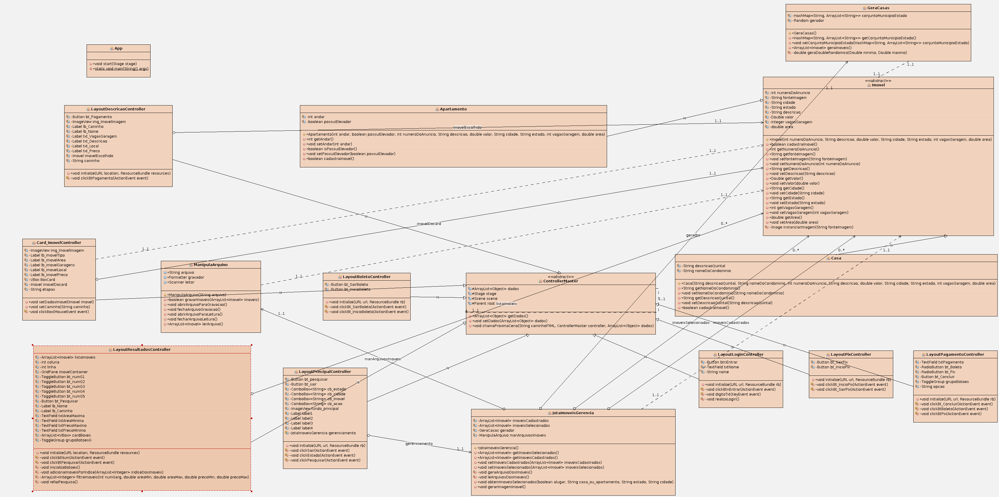

# Jota Imóveis

Jota Imóveis is a desktop real estate catalog built with Java 21 and JavaFX. It was originally developed as the final project for the Computer Programming II course and demonstrates a complete property-browsing flow, from searching the catalog to viewing a simulated payment screen.

> The application interface and sample property data are in Brazilian Portuguese, while the project documentation is in English.

## Table of contents

- [Features](#features)
- [Application flow](#application-flow)
- [Technology stack](#technology-stack)
- [Requirements](#requirements)
- [Getting started](#getting-started)
- [Local data](#local-data)
- [Project structure](#project-structure)
- [Architecture](#architecture)
- [Building a Windows installer](#building-a-windows-installer)
- [Authors](#authors)

## Features

- Search for houses or apartments available to buy or rent.
- Browse properties across Brazilian states and cities.
- Refine results by price range, floor area, and number of parking spaces.
- View property cards with photos and key listing information.
- Open a detailed view for a selected property.
- Navigate through simulated PIX and bank slip payment flows.
- Generate a sample catalog on the first launch and persist it locally.
- Play a looping background soundtrack while the application is running.
- Package the application as a self-contained Windows x64 installer.

## Application flow

1. Enter a name on the login screen.
2. Select an operation (`Comprar` or `Alugar`), property type, state, and city.
3. Browse up to ten matching listings.
4. Optionally refine the results by area, price, or parking spaces.
5. Open a listing to view its details.
6. Continue to the simulated PIX or bank slip payment screen.

The payment screens are for demonstration purposes only. The application does not connect to a payment provider or process real transactions.

## Technology stack

| Technology | Purpose |
| --- | --- |
| Java 21 | Application language and runtime |
| JavaFX 21 | Desktop user interface, FXML views, and media playback |
| Maven | Dependency management and build automation |
| CSS | JavaFX interface styling |
| TSV | Lightweight local catalog persistence |
| GitHub Actions | Automated Windows x64 packaging and releases |
| `jpackage` | Self-contained Windows installer generation |

## Requirements

To run the project from source, install:

- [JDK 21](https://adoptium.net/temurin/releases/?version=21) or another Java 21 distribution
- [Apache Maven 3.9+](https://maven.apache.org/download.cgi)

Verify the installation:

```powershell
java --version
mvn --version
```

## Getting started

Clone the repository and enter the project directory:

```powershell
git clone <repository-url>
cd ProjetoFinal_Imobiliaria
```

Run the application with the JavaFX Maven plugin:

```powershell
mvn clean javafx:run
```

Compile and package the project without launching the interface:

```powershell
mvn clean package
```

The build output is written to `target/`. Maven creates the application JAR as `target/jota-properties.jar` and copies its runtime dependencies to `target/dependency/`.

## Local data

On its first launch, the application generates a sample property catalog and saves it outside the repository:

```text
~/.jota-properties/properties.tsv
```

On Windows, `~` normally resolves to `C:\Users\<username>`. Later launches reuse this file. If the catalog cannot be read or written, the application falls back to temporary generated data for the current session.

To regenerate the catalog, close the application and delete only the `properties.tsv` file. A new catalog will be created the next time the application starts.

## Project structure

```text
.
|-- .github/
|   `-- workflows/          Windows installer and release automation
|-- docs/
|   `-- architecture.png    Original class diagram
|-- src/main/
|   |-- java/
|   |   |-- module-info.java
|   |   `-- com/jotaproperties/
|   |       |-- app/        JavaFX application entry point
|   |       |-- controller/ FXML screen controllers and navigation
|   |       |-- model/      Property, House, and Apartment domain models
|   |       |-- repository/ TSV catalog persistence
|   |       `-- service/    Catalog generation, selection, and business rules
|   `-- resources/
|       |-- audio/          Background soundtrack
|       |-- images/         Icons, backgrounds, property photos, and payment assets
|       |-- styles/         JavaFX CSS
|       `-- views/          FXML screen definitions
|-- pom.xml                 Maven configuration
`-- README.md
```

## Architecture

The project separates the interface, application logic, domain model, and file persistence into dedicated packages:

- Controllers load FXML views, respond to user actions, and manage navigation.
- `PropertyService` loads the catalog and selects properties based on the initial search.
- `PropertyGenerator` creates the sample listings and Brazilian location data.
- `PropertyFileRepository` reads and writes the UTF-8 TSV catalog.
- `Property`, `House`, and `Apartment` represent the domain model.

The original project diagram is available below:



## Building a Windows installer

The [`Windows Release`](.github/workflows/windows-release.yml) workflow runs on a Windows x64 runner and:

1. Installs Temurin JDK 21.
2. Builds the project with Maven.
3. Uses `jpackage` to create a self-contained `.exe` installer.
4. Uploads the installer as a workflow artifact.
5. Publishes or updates a GitHub Release when triggered by a tag.

The workflow can be started manually from the **Actions** tab to generate an installer artifact. To publish a release, create and push a version tag:

```powershell
git tag v1.0.0
git push origin v1.0.0
```

Release tags must follow the `v1`, `v1.0`, or `v1.0.0` numeric format. The generated installer includes the required Java runtime, adds optional Start Menu and desktop shortcuts, and does not require users to install Java separately.

## Authors

- Caio Lopes Malta
- Emanuel Victor Fonseca
- Gabriel Araujo Barbosa
- Lucas Henrique Ferreira
